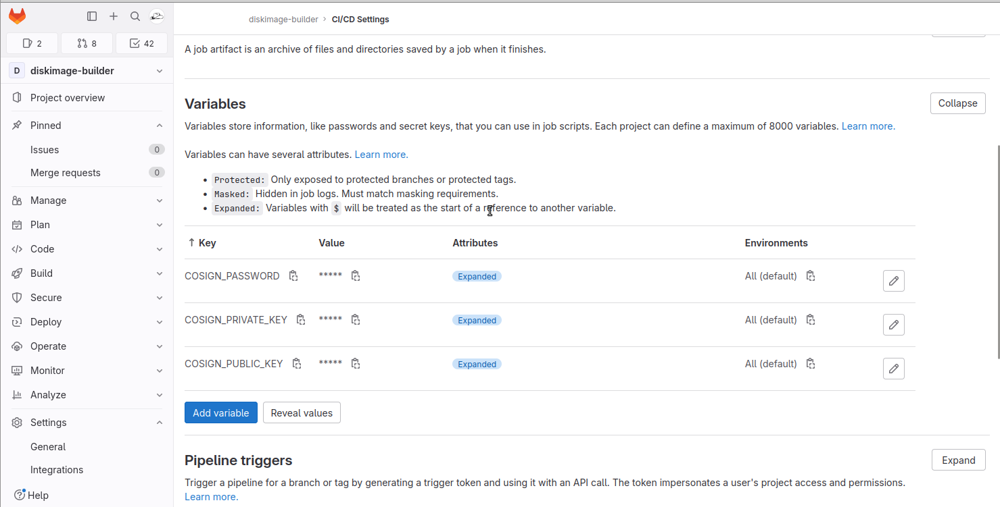

# Artifacts Signature

This document explains how to use `cosign` to sign the artifacts pushed to the OCI registry of this project.

## Generate Keys

The first step is to generate keys using the Gitlab provider with the command:

```shell
cosign generate-key-pair gitlab://<project_id>
```

For example:

Export the environment variable `GITLAB_TOKEN` with rights to create CI/CD variables:

```shell
export GITLAB_TOKEN=glpat-Z7Dj....
```

Then generate the cosign key pair with the Gitlab provider:

```shell
$ cosign generate-key-pair gitlab://43786055
Enter password for private key: 
Enter password for private key again: 
Password written to "COSIGN_PASSWORD" variable
Private key written to "COSIGN_PRIVATE_KEY" variable
Public key written to "COSIGN_PUBLIC_KEY" variable
Public key also written to cosign.pub
```

On success, three variables are added to the project:



The public key is available in this repository:

* https://gitlab.com/sylva-projects/sylva-elements/diskimage-builder/raw/main/security/cosign.pub

or, if the environment variable `GITLAB_TOKEN` has appropriate privilages, the public key can be retrieved as well with:

```shell
cosign public-key --key gitlab://43786055
```

## Signing

Signing the artifact identified by a tag can lead to sign a different image than the intended one. It is better to identify the artifact with a digest rather than tag.

The manifest digest can be obtained via the API or by using crane. We will use the later in the CI:

```shell
curl -s --header "PRIVATE-TOKEN: $GITLAB_TOKEN" https://gitlab.com/api/v4/projects/43786055/registry/repositories/4349498/tags/cosign-0.1 | jq '.digest'
"sha256:b4affd8071d5c30f302b50a29b524d97cc25727dddc3d1ab9a46275ac5471a3b"
```

```shell
crane digest registry.gitlab.com/sylva-projects/sylva-elements/diskimage-builder/diskimage-builder-hardened:cosign-0.1
sha256:b4affd8071d5c30f302b50a29b524d97cc25727dddc3d1ab9a46275ac5471a3b
```

Authenticate to the registry before signing because the signature shall be stored in the OCI repository as a new tag:

```shell
docker login -u $REGISTRY_USER -p $REGISTRY_PASSWORD registry.gitlab.com/sylva-projects/sylva-elements/diskimage-builder
```

Then sign the artifact. In the CI, we can sign by referring the environment variable `COSIGN_PRIVATE_KEY`:

> **_NOTE_**: when referring `COSIGN_PRIVATE_KEY`, the environment variable `COSIGN_PASSWORD` must be set, so that cosign can decrypt the private key

```shell
cosign sign --key env://COSIGN_PRIVATE_KEY registry.gitlab.com/sylva-projects/sylva-elements/diskimage-builder/diskimage-builder-hardened@sha256:b4affd8071d5c30f302b50a29b524d97cc25727dddc3d1ab9a46275ac5471a3b

    The sigstore service, hosted by sigstore a Series of LF Projects, LLC, is provided pursuant to the Hosted Project Tools Terms of Use, available at https://lfprojects.org/policies/hosted-project-tools-terms-of-use/.
    Note that if your submission includes personal data associated with this signed artifact, it will be part of an immutable record.
    This may include the email address associated with the account with which you authenticate your contractual Agreement.
    This information will be used for signing this artifact and will be stored in public transparency logs and cannot be removed later, and is subject to the Immutable Record notice at https://lfprojects.org/policies/hosted-project-tools-immutable-records/.

By typing 'y', you attest that (1) you are not submitting the personal data of any other person; and (2) you understand and agree to the statement and the Agreement terms at the URLs listed above.
tlog entry created with index: 27773186
Pushing signature to: registry.gitlab.com/sylva-projects/sylva-elements/diskimage-builder/diskimage-builder-hardened
```

It is also possible to sign by fetching the private key from Gitlab (assuming `GITLAB_TOKEN` with read access on project variables):

```shell
cosign sign --key gitlab://43786055 registry.gitlab.com/sylva-projects/sylva-elements/diskimage-builder/diskimage-builder-hardened@sha256:b4affd8071d5c30f302b50a29b524d97cc25727dddc3d1ab9a46275ac5471a3b
```

 We can get rid of crane when pushing and signing (`flux push artifact --help`):

```shell
digest_url = $(flux push artifact oci://ghcr.io/org/config/app:$(git rev-parse --short HEAD) \
--source="$(git config --get remote.origin.url)" \
--revision="$(git branch --show-current)@sha1:$(git rev-parse HEAD)" \
--path="./path/to/local/manifest.yaml" --output json | jq -r '. | .repository + "@" + .digest')

cosign sign $digest_url
```

## Verifying

The signature is verified against the public key fetched from an environment variable or from the Gitlab project hosting the registry:

```shell
$ cosign verify --key env://COSIGN_PUBLIC_KEY registry.gitlab.com/sylva-projects/sylva-elements/diskimage-builder/ubuntu-jammy-hardened-rke2-1-28-9:0.2.7
```

When using the Gitlab provider, set the environment varioable `GITLAB_TOKEN` with read access on Gitlab CI/CD variable:

```shell
$ export GITLAB_TOKEN=glpat-..... 

$ cosign verify --key gitlab://43786055 registry.gitlab.com/sylva-projects/sylva-elements/diskimage-builder/ubuntu-jammy-hardened-rke2-1-28-9:0.2.7

Verification for registry.gitlab.com/sylva-projects/sylva-elements/diskimage-builder/ubuntu-jammy-hardened-rke2-1-28-9:0.2.7 --
The following checks were performed on each of these signatures:
  - The cosign claims were validated
  - Existence of the claims in the transparency log was verified offline
  - The signatures were verified against the specified public key

[{"critical":{"identity":{"docker-reference":"registry.gitlab.com/sylva-projects/sylva-elements/diskimage-builder/ubuntu-jammy-hardened-rke2-1-28-9"},"image":{"docker-manifest-digest":"sha256:26c25b45429d63539ff975f9e9914acb57f1f11f40dfc167963a555534fed504"},"type":"cosign container image signature"},"optional":{"Bundle":{"SignedEntryTimestamp":"MEUCIQDG8pgp0VTJUrfnL+Wz9nPqW6DRgHIHPNYalsBcgC32PAIgSJi7b8vvQDMmb8mTsUqjpSTpn3hs2W+axgPnGQAl4UA=","Payload":{"body":"eyJhcGlWZXJzaW9uIjoiMC4wLjEiLCJraW5kIjoiaGFzaGVkcmVrb3JkIiwic3BlYyI6eyJkYXRhIjp7Imhhc2giOnsiYWxnb3JpdGhtIjoic2hhMjU2IiwidmFsdWUiOiI2YTY2OGJhNzE4YmNkY2NhOWRhMTZmOGRmMGRjMThiMGIzZGEyNzIwMzM2MDdjODgzOWUzMzU5ZTJjOTVjNzZiIn19LCJzaWduYXR1cmUiOnsiY29udGVudCI6Ik1FVUNJUURSZDh5dmZYWDFXT2dSK0ErSU5abTFDeGZQbFIxaFhiWEl2NHA3MzVMRnRRSWdUbFBXejVlZ2ZnQlV4NHArNjlqTE95UTZIVzVSM09VRUFDanRpODlGNVk0PSIsInB1YmxpY0tleSI6eyJjb250ZW50IjoiTFMwdExTMUNSVWRKVGlCUVZVSk1TVU1nUzBWWkxTMHRMUzBLVFVacmQwVjNXVWhMYjFwSmVtb3dRMEZSV1VsTGIxcEplbW93UkVGUlkwUlJaMEZGWTNWMVRITjZkM2t3ZFRkNU16azBTMWsyUjFjeFFtZHFabUZWTmdwaFN6ZGxPVFZOVml0cGExcHVVbVpTTlVWSWRIRkZhekYwVTJOT2FFMXhVVXBOY0hWR2N6TlJTREZVVmtKeU5sUkpWMVpNZURWalZYUm5QVDBLTFMwdExTMUZUa1FnVUZWQ1RFbERJRXRGV1MwdExTMHRDZz09In19fX0=","integratedTime":1715701994,"logIndex":93773388,"logID":"c0d23d6ad406973f9559f3ba2d1ca01f84147d8ffc5b8445c224f98b9591801d"}}}}]
``` 


> **_NOTE_**: use the option `--insecure-ignore-tlog=true` in air-gap environment.

The signature can be verified against the public key stored in the directory `security` of the project `sylva-projects/sylva-elements/diskimage-builder/`:

```shell
$ cosign verify --key https://gitlab.com/sylva-projects/sylva-elements/diskimage-builder/raw/main/security/cosign.pub \
--insecure-ignore-tlog=true \
registry.gitlab.com/sylva-projects/sylva-elements/diskimage-builder/ubuntu-jammy-hardened-rke2-1-28-9:0.2.7 \
| jq
WARNING: Skipping tlog verification is an insecure practice that lacks of transparency and auditability verification for the signature.

Verification for registry.gitlab.com/sylva-projects/sylva-elements/diskimage-builder/ubuntu-jammy-hardened-rke2-1-28-9:0.2.7 --
The following checks were performed on each of these signatures:
  - The cosign claims were validated
  - The signatures were verified against the specified public key
[
  {
    "critical": {
      "identity": {
        "docker-reference": "registry.gitlab.com/sylva-projects/sylva-elements/diskimage-builder/ubuntu-jammy-hardened-rke2-1-28-9"
      },
      "image": {
        "docker-manifest-digest": "sha256:26c25b45429d63539ff975f9e9914acb57f1f11f40dfc167963a555534fed504"
      },
      "type": "cosign container image signature"
    },
    "optional": {
      "Bundle": {
        "SignedEntryTimestamp": "MEUCIQDG8pgp0VTJUrfnL+Wz9nPqW6DRgHIHPNYalsBcgC32PAIgSJi7b8vvQDMmb8mTsUqjpSTpn3hs2W+axgPnGQAl4UA=",
        "Payload": {
          "body": "eyJhcGlWZXJzaW9uIjoiMC4wLjEiLCJraW5kIjoiaGFzaGVkcmVrb3JkIiwic3BlYyI6eyJkYXRhIjp7Imhhc2giOnsiYWxnb3JpdGhtIjoic2hhMjU2IiwidmFsdWUiOiI2YTY2OGJhNzE4YmNkY2NhOWRhMTZmOGRmMGRjMThiMGIzZGEyNzIwMzM2MDdjODgzOWUzMzU5ZTJjOTVjNzZiIn19LCJzaWduYXR1cmUiOnsiY29udGVudCI6Ik1FVUNJUURSZDh5dmZYWDFXT2dSK0ErSU5abTFDeGZQbFIxaFhiWEl2NHA3MzVMRnRRSWdUbFBXejVlZ2ZnQlV4NHArNjlqTE95UTZIVzVSM09VRUFDanRpODlGNVk0PSIsInB1YmxpY0tleSI6eyJjb250ZW50IjoiTFMwdExTMUNSVWRKVGlCUVZVSk1TVU1nUzBWWkxTMHRMUzBLVFVacmQwVjNXVWhMYjFwSmVtb3dRMEZSV1VsTGIxcEplbW93UkVGUlkwUlJaMEZGWTNWMVRITjZkM2t3ZFRkNU16azBTMWsyUjFjeFFtZHFabUZWTmdwaFN6ZGxPVFZOVml0cGExcHVVbVpTTlVWSWRIRkZhekYwVTJOT2FFMXhVVXBOY0hWR2N6TlJTREZVVmtKeU5sUkpWMVpNZURWalZYUm5QVDBLTFMwdExTMUZUa1FnVUZWQ1RFbERJRXRGV1MwdExTMHRDZz09In19fX0=",
          "integratedTime": 1715701994,
          "logIndex": 93773388,
          "logID": "c0d23d6ad406973f9559f3ba2d1ca01f84147d8ffc5b8445c224f98b9591801d"
        }
      }
    }
  }
]
```shell

The payload is actually a [Hashed Rekord](https://github.com/sigstore/rekor/blob/main/types.md#hashed-rekord) 
